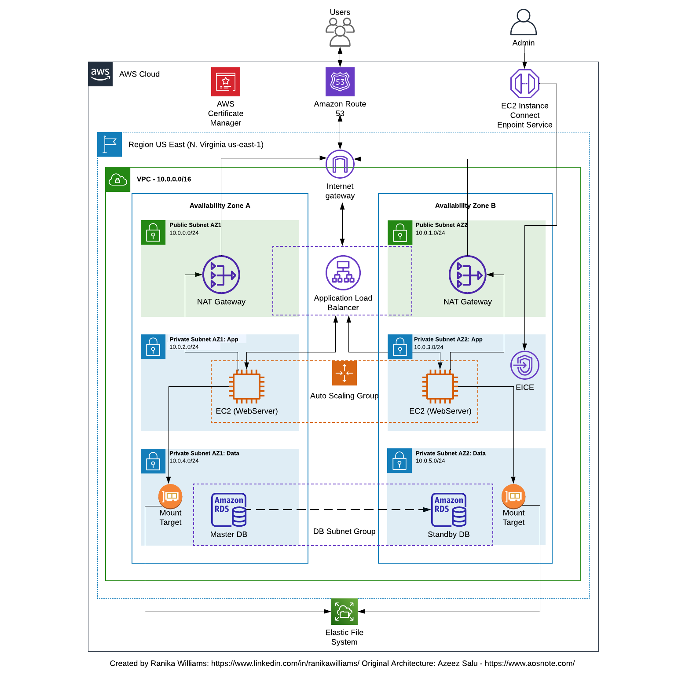

# Deploy a 3-Tier Network VPC Wordpress Website on AWS

---

## Project Overview

This project involves deploying a WordPress website on Amazon Web Services (AWS) infrastructure using various AWS services and configurations. The deployment process includes setting up a Virtual Private Cloud (VPC), launching EC2 instances, configuring security groups, setting up auto-scaling, and more.

## Architecture

The project involves deploying a WordPress website on AWS using the following resources and configurations:

- **Virtual Private Cloud (VPC)**: Configured with public and private subnets across two availability zones for enhanced reliability and security.

- **Internet Gateway**: Deployed to facilitate connectivity between VPC instances and the wider internet.

- **Security Groups**: Security groups were established as a network firewall mechanism to control traffic to and from instances.

- **Availability Zones**: Utilized two availability zones for improved system reliability and fault tolerance.

- **Public Subnets**: Utilized public subnets for infrastructure components like the NAT Gateway and Application Load Balancer.

- **EC2 Instance Connect Endpoint**: Implemented EC2 Instance Connect Endpoint for secure connections to resouces within both public and private subnets.

- **Private Subnets**: Positioned web servers (EC2 instances) within private subnets for enhanced security.

- **NAT Gateway**: Enabled instances in both private subnets to access the internet while maintaining security.

- **EC2 Instances**: Hosted the WordPress website on EC2 Instances.

- **Application Load Balancer (ALB)**: Employed an application load balancer and a target group for evenly distributing web traffic to an Auto Scaling Group of EC2 instances across multiple availability zones.

- **Auto Scaling Group (ASG)**: Utilized an Auto Scaling Group to automatically manage EC2 instances, ensuring website availability, scalability, fault tolerance, and elasticity.

- **Version Control**: Stored web files on GitHub for version control and collaboration.

- **Certificate Manager**: Secured application communications using a Certificate Manager.

- **Simple Notification Service (SNS)**: Configured SNS to alert about activities within the auto-scaling group.

- **Route 53**: Registered the domain name and set up a DNS record using Route 53.

- **Elastic File System (EFS)**: Utilized EFS for a shared file system.

- **Amazon RDS (Relational Database Service)**: Used RDS for the database.

## Deployment Scripts

The project includes deployment scripts to automate the setup and configuration of the WordPress website on AWS:

1. **WordPress Installation Script**:
   - Installs Apache web server, PHP 8, MySQL, and configures permissions.
   - Downloads WordPress files and sets up the wp-config.php file.
   - Restarts the web server for changes to take effect.

2. **Auto Scaling Group Launch Template Script**:
   - Updates software packages, installs Apache, PHP 8, MySQL, and configures permissions.
   - Mounts EFS to the HTML directory for shared file access.
   - Restarts the web server for changes to take effect.

## Getting Started
To deploy the WordPress website on AWS, follow these steps:

1. Clone or download the repository containing the deployment scripts and configurations.
2. Review the scripts and modify any necessary parameters to match your AWS environment.
3. Execute the scripts in the specified order to provision the required infrastructure and deploy WordPress.
4. Monitor the deployment process and ensure all resources are provisioned successfully.
5. Access the WordPress website using the provided domain name or IP address.
6. Test the website functionality and ensure it's running as expected.
7. Optionally, customize the WordPress installation according to your requirements.
8. For ongoing management, refer to AWS documentation for individual services used.

## Repository Structure
- **Scripts**: Contains deployment scripts for installing WordPress and configuring auto-scaling.
- **Diagrams**: Includes reference diagrams illustrating the AWS architecture.
- **README.md**: Provides an overview of the project and instructions for deployment.

## Contributing

Feel free to contribute, suggest improvements, or report issues by opening an issue or pull request on the GitHub repository.

## License
This project is licensed under the [MIT License](LICENSE).

## Resources

- [AWS Documentation](https://aws.amazon.com/documentation/)
- [WordPress Documentation](https://wordpress.org/support/)
- [GitHub Repository](https://github.com/rnkwilliams/host-a-static-wordpress-website-on-aws)
  
---
